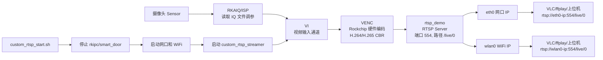

# RV1106 自编码 RTSP 推流说明

这个方案让板子自己完成摄像头采集、硬件编码和 RTSP 输出。WiFi 和网口不是两套不同的视频链路，而是同一个 RTSP 服务监听在板子上；只要 `eth0` 和 `wlan0` 都有 IP，就可以分别用两个地址访问同一路流。

## 我在工程里加了什么

- `project/app/custom_rtsp_streamer/Makefile`
  - 接入 SDK 的 `project/app/Makefile` 自动构建流程。
  - 编译 Rockchip 示例 `media/samples/simple_test/simple_vi_bind_venc_rtsp.c`，输出为 `custom_rtsp_streamer`。
- `project/app/custom_rtsp_streamer/custom_rtsp_start.sh`
  - 停止默认摄像头应用，释放 `VI/VENC` 资源。
  - 拉起 `eth0` DHCP。
  - 拉起 `wlan0`，可使用已有 `wpa_supplicant.conf`，也可通过环境变量写入 WiFi。
  - 启动 `custom_rtsp_streamer`，打印可播放的 RTSP 地址。
- `project/app/custom_rtsp_streamer/custom_rtsp_stop.sh`
  - 停止自编码 RTSP 程序。

## 架构逻辑



## 编译

这个 SDK 是 Linux 交叉编译工程，不建议在 Windows PowerShell 里直接编。用 Ubuntu/WSL/Linux 主机进入 SDK 根目录：

```bash
cd /path/to/rvtest
./build.sh lunch
```

选择你的 RV1106 板型，例如 Luckfox Pico Ultra/Pro Max 对应的 `BoardConfig-...RV1106...IPC.mk`。

然后编译媒体库和应用：

```bash
./build.sh media
./build.sh app
```

编译完成后应看到：

```text
output/out/app_out/bin/custom_rtsp_streamer
output/out/app_out/bin/custom_rtsp_start.sh
output/out/app_out/bin/custom_rtsp_stop.sh
```

如果要打完整固件：

```bash
./build.sh firmware
```

打包进固件后，文件通常在板子的：

```text
/oem/usr/bin/custom_rtsp_streamer
/oem/usr/bin/custom_rtsp_start.sh
/oem/usr/bin/custom_rtsp_stop.sh
```

## 板端运行

最简单启动：

```sh
/oem/usr/bin/custom_rtsp_start.sh
```

如果第一次配置 WiFi：

```sh
WIFI_SSID="你的WiFi名" WIFI_PSK="你的WiFi密码" /oem/usr/bin/custom_rtsp_start.sh
```

常用参数：

```sh
WIDTH=1280 HEIGHT=720 BITRATE=2048 CODEC=h264 /oem/usr/bin/custom_rtsp_start.sh
```

参数含义：

- `WIDTH` / `HEIGHT`：编码分辨率，默认 `1920x1080`。
- `BITRATE`：码率，单位 Kbps，默认 `4096`，WiFi 下建议先用 `2048` 或 `4096`。
- `CODEC`：`h264` 或 `h265`，建议先用 `h264`，兼容性最好。
- `CAMID`：VI 通道，默认 `0`。
- `START_ETH`：是否启动网口 DHCP，默认 `1`。
- `START_WIFI`：是否启动 WiFi，默认 `1`。
- `IP_WAIT_SECONDS`：启动后等待网口或 WiFi 获取 IP 的秒数，默认 `10`。
- `STOP_DEFAULT_APP`：是否停止 `rkipc/smart_door`，默认 `1`。
- `IQ_DIR`：IQ 文件目录，脚本会自动从 `/etc/iqfiles`、`/oem/usr/share/iqfiles`、`/usr/share/iqfiles` 中选择。

停止：

```sh
/oem/usr/bin/custom_rtsp_stop.sh
```

## 播放地址

脚本启动成功后会打印类似：

```text
[custom-rtsp] eth0 RTSP: rtsp://192.168.1.20:554/live/0
[custom-rtsp] wlan0 RTSP: rtsp://192.168.1.35:554/live/0
```

电脑上播放：

```bash
ffplay rtsp://192.168.1.20:554/live/0
ffplay rtsp://192.168.1.35:554/live/0
```

VLC 也可以直接打开同样的 RTSP 地址。

## 常见问题

1. 端口被占用或摄像头打不开

   默认 `rkipc` 或 `smart_door` 可能已经占用了摄像头和编码器。脚本默认会停止它们。如果还是失败：

   ```sh
   killall rkipc
   killall smart_door
   killall custom_rtsp_streamer
   /oem/usr/bin/custom_rtsp_start.sh
   ```

2. WiFi 没有 IP

   查看状态：

   ```sh
   wpa_cli -i wlan0 status
   ifconfig wlan0
   cat /tmp/custom_rtsp_wifi.log
   ```

3. 网口没有 IP

   ```sh
   ifconfig eth0 up
   udhcpc -i eth0 -T 1 -A 0 -b -q
   ifconfig eth0
   ```

4. 播放器打不开 H.265

   先使用 `CODEC=h264`，很多播放器和浏览器链路对 H.264 支持更稳定。

5. WiFi 卡顿

   先降分辨率和码率：

   ```sh
   WIDTH=1280 HEIGHT=720 BITRATE=2048 CODEC=h264 /oem/usr/bin/custom_rtsp_start.sh
   ```

## 和原工程的关系

原来的 `rkipc` 本身也能提供 RTSP，这是厂商 IPC 主程序方案。这里新增的是一个更小的自编码入口，直接跑：

```text
Sensor -> ISP/RKAIQ -> VI -> VENC -> RTSP
```

它适合你从零理解和验证“板子自己编码推 RTSP 流”的最小闭环。后续如果要做多路码流、OSD、音频、鉴权、Web 控制，再把这些能力继续往这个入口上加，或者回到 `rkipc` 的完整 IPC 框架里改。
