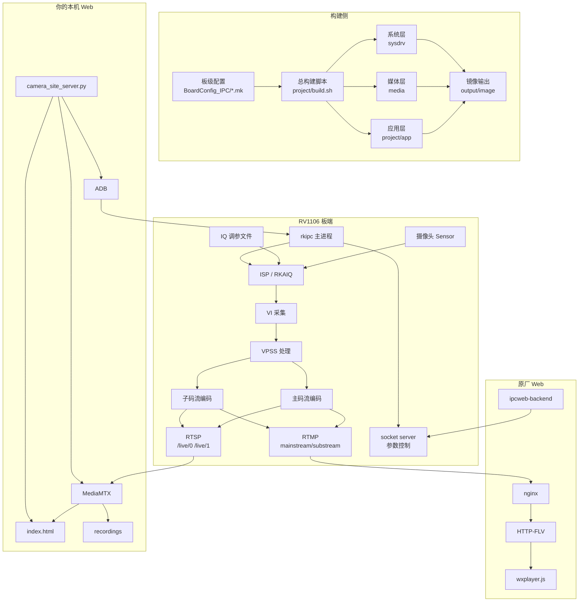

# RV1106 工程从零阅读指南

这份文档面向第一次拿到 `rvtest` 工程、对 Rockchip / Luckfox / 嵌入式 Linux / 摄像头 SDK 都不熟的人。目标不是马上改代码，而是先建立一张清晰地图：这个工程是什么、从哪里开始看、每一层负责什么、后续改功能应该进哪个目录。

## 0. 先建立一个总认识

这个工程不是一个单独的 Web 项目，也不是一个普通 C 程序。它是一套 **Rockchip RV1106 / Luckfox Pico IPC 摄像头 SDK 工作树**，外加一个本机 Windows Web 监控台。

可以把它理解成 4 层：

```text
第 4 层：本机 Web 监控台
        web/rv1106_camera_dashboard

第 3 层：板端摄像头应用
        project/app/rkipc
        project/app/ipcweb

第 2 层：媒体能力与算法库
        media

第 1 层：系统 BSP 和固件
        sysdrv
```

真正跑在 RV1106 板子上的核心是 `rkipc`。你的浏览器页面只是连到它输出的视频流，或者通过 ADB 修改它的配置。

## 1. 第一次打开工程，不要从哪里看

不要一上来从这些地方开始：

- 不要先看 `sysdrv/source/kernel`。Linux kernel 太大，先看会迷路。
- 不要先全局搜索所有 `video.c`。这个 SDK 支持多个芯片和多个应用，容易看错分支。
- 不要先看 `media/` 的所有库。它多数是 Rockchip 媒体 SDK 和预编译库，先理解调用关系更重要。
- 不要先尝试 Windows 下完整编译。完整 SDK 应该在 Linux / Ubuntu / WSL2 Linux 环境编译。

第一次阅读应该按“板型配置 -> 构建入口 -> 运行入口 -> 视频链路 -> Web 链路”的顺序走。

## 2. 推荐阅读路线

### 第一阶段：确认这是什么板子

先看板级配置：

```text
project/cfg/BoardConfig_IPC/BoardConfig-EMMC-Buildroot-RV1106_Luckfox_Pico_Ultra-IPC.mk
```

重点看这些变量：

```bash
RK_CHIP=rv1106
RK_APP_TYPE=RKIPC_RV1106
RK_KERNEL_DTS=rv1106g-luckfox-pico-ultra.dts
RK_ARCH=arm
RK_TOOLCHAIN_CROSS=arm-rockchip830-linux-uclibcgnueabihf
RK_BUILDROOT_DEFCONFIG=luckfox_pico_w_defconfig
RK_CAMERA_SENSOR_IQFILES=...
RK_POST_OVERLAY=...
```

读完你要回答几个问题：

- 目标芯片是什么？这里是 `rv1106`。
- 板型是什么？这里是 Luckfox Pico Ultra 这一类 RV1106 板。
- rootfs 是什么？这里是 Buildroot。
- 应用类型是什么？这里是 `RKIPC_RV1106`。
- 摄像头 IQ 文件有哪些？这决定支持哪些 sensor / 模组调参文件。

### 第二阶段：理解 SDK 如何编译

看总构建入口：

```text
project/build.sh
```

先不用逐行看完整脚本，只看它支持哪些命令：

```bash
./build.sh lunch
./build.sh info
./build.sh check
./build.sh sysdrv
./build.sh media
./build.sh app
./build.sh firmware
./build.sh allsave
```

理解这几个目标：

| 命令 | 作用 |
| --- | --- |
| `lunch` | 选择板型，生成 SDK 根目录的 `.BoardConfig.mk`。 |
| `sysdrv` | 编 U-Boot、kernel、rootfs、驱动。 |
| `media` | 编 Rockchip 媒体库、样例和相关资源。 |
| `app` | 编板端应用，例如 `rkipc`、`ipcweb`。 |
| `firmware` | 把系统、媒体库、应用、overlay 打包成镜像。 |
| `allsave` | 完整编译并保存调试信息，通常是第一次完整构建入口。 |

构建产物通常在：

```text
output/image
```

### 第三阶段：理解板端主程序 `rkipc`

看这个文件：

```text
project/app/rkipc/rkipc/src/rv1106_ipc/main.c
```

这个文件告诉你 `rkipc` 启动时做了什么。按顺序理解这些初始化：

```text
读取参数 -> 初始化配置 -> 网络 -> 系统 -> ISP -> RK_MPI -> 视频 -> 音频 -> socket server -> 存储
```

你会看到类似这些模块：

```c
rk_param_init(...)
rk_network_init(...)
rk_system_init()
rk_isp_init(...)
RK_MPI_SYS_Init()
rk_video_init()
rkipc_audio_init()
rkipc_server_init()
rk_storage_init()
```

读完你要知道：

- `/userdata/rkipc.ini` 是运行时配置文件。
- `/oem/usr/share/iqfiles` 是 IQ 文件目录。
- `rk_video_init()` 是视频链路的核心入口。
- `rkipc_server_init()` 给 Web 后端或控制端提供参数读写能力。

### 第四阶段：理解运行配置 `rkipc.ini`

看这个配置：

```text
project/app/rkipc/rkipc/src/rv1106_ipc/rkipc-500w.ini
```

重点看这些段：

```ini
[video.source]
enable_aiq = 1
enable_venc_0 = 1
enable_venc_1 = 1
enable_rtsp = 1
enable_rtmp = 1

[video.0]
stream_type = mainStream
width = ...
height = ...
output_data_type = H.265

[video.1]
stream_type = subStream
width = ...
height = ...
output_data_type = H.265
```

读完你要知道：

- `video.0` 是主码流。
- `video.1` 是子码流。
- `enable_rtsp` 控制 RTSP 输出。
- `enable_rtmp` 控制 RTMP 输出。
- 浏览器播放通常需要 H.264，所以你的 Web 工具会把 `output_data_type` 改成 `H.264`。

### 第五阶段：理解视频采集和编码链路

看这个文件：

```text
project/app/rkipc/rkipc/src/rv1106_ipc/video/video.c
```

这不是第一眼就能完全看懂的文件。建议只按功能块看：

1. 先看顶部常量：

```c
RTSP_URL_0 "/live/0"
RTSP_URL_1 "/live/1"
RTMP_URL_0 "rtmp://127.0.0.1:1935/live/mainstream"
RTMP_URL_1 "rtmp://127.0.0.1:1935/live/substream"
```

2. 再看 `rk_video_init()`：

```text
读取 enable_xxx 配置
初始化 VI
初始化 RTSP
初始化 RTMP
初始化主码流 pipe
初始化子码流 pipe
初始化 JPEG / OSD / IVA 等
```

3. 再看取编码流的线程：

```text
rkipc_get_venc_0
rkipc_get_venc_1
```

这些线程把编码后的 H.264/H.265 数据写给：

```text
RTSP
RTMP
本地存储
```

读完你要能画出这条链：

```text
Sensor -> ISP -> VI -> VPSS -> VENC0/VENC1 -> RTSP/RTMP/Storage
```

### 第六阶段：理解原厂 Web 链路

看这些文件：

```text
project/app/ipcweb/ipcweb-backend/README.md
project/app/ipcweb/ipcweb-backend/src/main.cpp
project/app/ipcweb/ipcweb-backend/src/stream_api.cpp
project/app/ipcweb/ipcweb-backend/ipcweb-env-arm/etc/nginx/nginx.conf
project/app/ipcweb/ipcweb-backend/www-rkipc/index.html
```

理解它的作用：

- `ipcweb-backend` 是 C++ CGI / REST API 后端。
- `nginx.conf` 监听 80 端口。
- `/live` 开启 `flv_live on`，用于 HTTP-FLV。
- `stream_api.cpp` 会拼出播放地址：

```text
http://<板卡IP>:80/live?port=1935&app=live&stream=mainstream
http://<板卡IP>:80/live?port=1935&app=live&stream=substream
```

这说明 Rockchip 原厂 Web 方案偏向：

```text
rkipc -> RTMP -> nginx-rtmp -> HTTP-FLV -> wxplayer.js
```

### 第七阶段：理解你自己的 Web 监控台

看这些文件：

```text
web/rv1106_camera_dashboard/mediamtx.yml
web/rv1106_camera_dashboard/camera_site_server.py
web/rv1106_camera_dashboard/index.html
web/rv1106_camera_dashboard/start_camera_site.ps1
web/rv1106_camera_dashboard/操作指南.md
```

它不是板端固件的一部分，而是 Windows 本机工具。它的链路是：

```text
RV1106 rkipc -> RTSP /live/0 /live/1 -> MediaMTX -> WebRTC/HLS -> 浏览器
```

`camera_site_server.py` 做这些事：

- 提供 `http://localhost:8080/index.html`
- 提供 `/api/status`
- 提供录制开始 / 停止 API
- 调 MediaMTX 配置录像
- 通过 ADB 改 `/userdata/rkipc.ini`
- 重启板端 `rkipc`

`index.html` 是浏览器 UI，负责：

- 选择主码流 / 子码流
- 选择 WebRTC / HLS
- 开始 / 停止录制
- 切换画质预设
- 查看历史录像

## 3. 完整架构理解图



## 4. 一天内读懂工程的安排

### 第 1 小时：只看目录和板级配置

目标：知道每个顶层目录是干什么的。

看：

```text
agent.md
claude.md
project/cfg/BoardConfig_IPC/BoardConfig-EMMC-Buildroot-RV1106_Luckfox_Pico_Ultra-IPC.mk
```

不要深挖源码。

### 第 2-3 小时：看构建链路

目标：知道 SDK 如何从源码变成固件。

看：

```text
project/build.sh
project/app/Makefile
media/Makefile
sysdrv/Makefile
```

只看入口和目标，不看所有函数。

### 第 4-5 小时：看 `rkipc` 主链路

目标：知道板端摄像头服务如何启动。

看：

```text
project/app/rkipc/rkipc/src/rv1106_ipc/main.c
project/app/rkipc/rkipc/src/rv1106_ipc/rkipc-500w.ini
project/app/rkipc/rkipc/src/rv1106_ipc/video/video.c
```

只追 `main -> rk_video_init -> RTSP/RTMP/VENC`。

### 第 6 小时：看原厂 Web

目标：知道 Rockchip 原厂网页如何拿视频和参数。

看：

```text
project/app/ipcweb/ipcweb-backend/src/stream_api.cpp
project/app/ipcweb/ipcweb-backend/ipcweb-env-arm/etc/nginx/nginx.conf
project/app/ipcweb/ipcweb-backend/doc/IPC_RESTful_API_Guide.md
```

### 第 7 小时：看本机 Web

目标：知道你的 Web 工具如何桥接 RTSP、MediaMTX、浏览器和 ADB。

看：

```text
web/rv1106_camera_dashboard/mediamtx.yml
web/rv1106_camera_dashboard/camera_site_server.py
web/rv1106_camera_dashboard/index.html
web/rv1106_camera_dashboard/操作指南.md
```

## 5. 如果你的目标不同，从这里开始

| 目标 | 先看哪里 |
| --- | --- |
| 想知道工程是什么 | `agent.md`、本文档、`project/cfg/BoardConfig_IPC/*.mk` |
| 想完整编译固件 | `project/build.sh`、`tools/linux/toolchain`、`project/scripts/build-depend-tools.txt` |
| 想改摄像头分辨率 / 码率 | `rkipc-*.ini`、`video/video.c` |
| 想改 RTSP 地址或视频输出 | `video/video.c`、`common/rtsp`、`common/rtmp` |
| 想改原厂 Web API | `project/app/ipcweb/ipcweb-backend/src` |
| 想改本机浏览器页面 | `web/rv1106_camera_dashboard/index.html` |
| 想改录制、画质切换、ADB 控制 | `web/rv1106_camera_dashboard/camera_site_server.py` |
| 想适配新板子 | `BoardConfig_IPC`、kernel DTS、U-Boot DTS、Buildroot defconfig |
| 想适配新 sensor | DTS、IQ 文件、`RK_CAMERA_SENSOR_IQFILES`、`rkipc.ini` |

## 6. 关键概念速查

| 名词 | 含义 |
| --- | --- |
| RV1106 | Rockchip 低功耗 IPC / AI 摄像头芯片。 |
| Luckfox Pico | 基于 RV1103 / RV1106 的开发板系列。 |
| BSP | Board Support Package，板级支持包，包括 kernel、U-Boot、DTS、驱动等。 |
| DTS | Device Tree Source，描述硬件连接。 |
| Buildroot | 用来构建嵌入式 Linux rootfs 的系统。 |
| RKAIQ | Rockchip ISP 自动图像质量算法库。 |
| ISP | 图像信号处理，处理曝光、白平衡、降噪、色彩等。 |
| VI | Video Input，视频采集。 |
| VPSS | 视频处理子系统，用于缩放、旋转、多路输出等。 |
| VENC | 视频编码器，输出 H.264/H.265/JPEG。 |
| rkipc | Rockchip IPC 摄像头参考主程序。 |
| RTSP | 常见监控摄像头实时流协议。 |
| RTMP | 原厂 Web HTTP-FLV 链路前面的推流协议。 |
| HTTP-FLV | 浏览器可播放的一种低延迟流封装方式，原厂 Web 使用。 |
| MediaMTX | 你本机 Web 端用来把 RTSP 转成 WebRTC/HLS 的开源媒体服务器。 |
| ADB | Android Debug Bridge，这里用于远程进入板端 shell、改配置、重启进程。 |

## 7. 阅读时要记录的问题

建议你边看边维护一张表：

| 问题 | 记录 |
| --- | --- |
| 我的实际板型是哪一个？ | 例如 RV1106 Luckfox Pico Ultra |
| 板子 IP 是多少？ | 例如 192.168.31.18 |
| RTSP 是否可访问？ | `rtsp://<ip>/live/0` |
| 当前编码是 H.264 还是 H.265？ | 浏览器播放通常需要 H.264 |
| 当前使用哪个 rkipc.ini？ | `/userdata/rkipc.ini` |
| IQ 文件目录在哪里？ | `/oem/usr/share/iqfiles` |
| 我改的是板端代码还是本机 Web？ | 两者编译/运行方式完全不同 |

## 8. 判断你是否已经理解这个工程

你能回答下面问题，就说明已经入门：

1. 这个工程的目标芯片是什么？
2. 当前板型配置文件是哪一个？
3. `rkipc` 从哪里读取运行配置？
4. 主码流和子码流分别在哪里配置？
5. `/live/0` 和 `/live/1` 是谁提供的？
6. 原厂 Web 为什么能播放 HTTP-FLV？
7. 本机 Web 为什么需要 MediaMTX？
8. 只改 `web/rv1106_camera_dashboard` 是否需要重新编固件？
9. 只改 `rkipc` 后需要执行哪些构建命令？
10. 完整固件输出在哪里？

如果这些问题还答不上来，继续按本文第 2 节的路线读，不要急着改代码。
