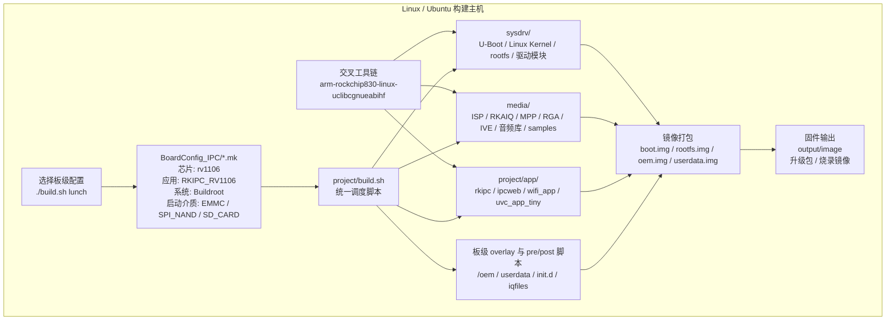
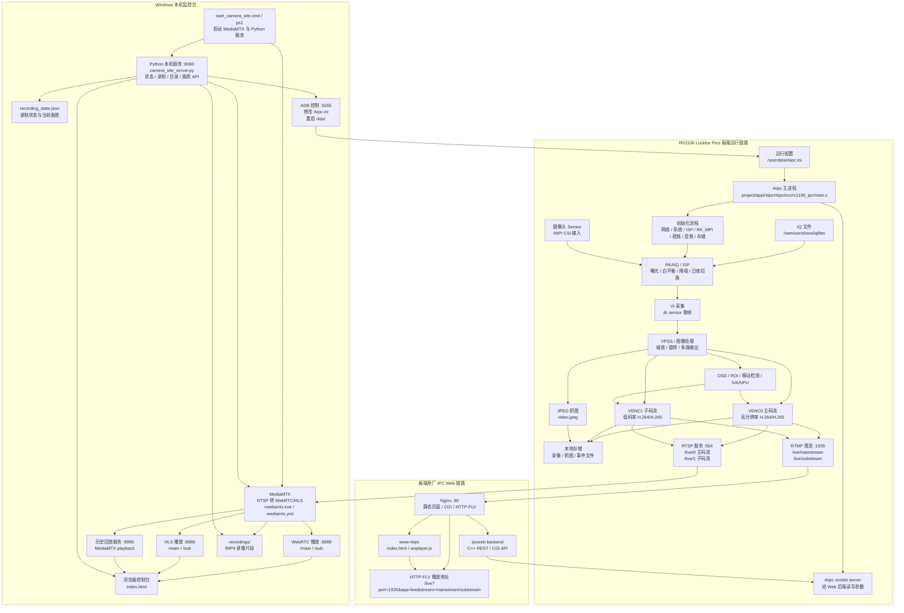

# RV1106 Camera SDK Project Guide

## 1. 系统定位

这个工程不是一个普通 Web 项目，而是一套面向 Luckfox Pico / Rockchip RV1106 系列板卡的 Linux IPC 摄像头 SDK 工作树。它覆盖从底层固件、媒体库、摄像头业务应用到本机网页监控台的完整链路。

当前目录不是 Git 仓库根目录，根部没有 `.git`。按已展开的 SDK 工作树处理。

核心目录如下：

| 路径 | 作用 |
| --- | --- |
| `sysdrv/` | 系统驱动与系统镜像层，包含 U-Boot、Linux kernel、rootfs、板端工具、kernel module 等构建入口。 |
| `media/` | Rockchip 媒体能力层，包含 ISP、MPP、RGA、IVE/IVA、音频、样例程序和相关预编译库。 |
| `project/` | 产品工程层，包含板卡配置、总构建脚本、应用打包、分区、overlay、固件封装逻辑。 |
| `project/app/rkipc/` | 板端 IPC 摄像头主进程，负责采集、ISP、编码、RTSP/RTMP、存储、OSD、网络、音频、AI/IVA 等。 |
| `project/app/ipcweb/` | 原厂 IPC Web 后端和前端资源，提供 CGI/REST API、Nginx、HTTP-FLV 播放页面等。 |
| `tools/` | Linux/Windows 烧录、升级、打包、交叉编译工具。 |
| `web/rv1106_camera_dashboard/` | 当前工程额外放置的 Windows 本机网页监控台，用 MediaMTX 把板端 RTSP 转成浏览器可播放的 WebRTC/HLS，并提供录制和画质切换。 |

## 2. 目标芯片

从板级配置看，目标芯片是 Rockchip `rv1106`，对应 Luckfox Pico 系列 IPC 板卡。

关键证据：

- `project/cfg/BoardConfig_IPC/BoardConfig-EMMC-Buildroot-RV1106_Luckfox_Pico_Ultra-IPC.mk` 中设置 `export RK_CHIP=rv1106`。
- 同一配置设置 `export RK_APP_TYPE=RKIPC_RV1106`。
- 编译架构为 `export RK_ARCH=arm`。
- 交叉工具链为 `export RK_TOOLCHAIN_CROSS=arm-rockchip830-linux-uclibcgnueabihf`。
- 内核 DTS 示例为 `rv1106g-luckfox-pico-ultra.dts`。

这个 SDK 也包含 RV1103、RV1126、RK3588 的部分通用代码或预编译库，但当前项目主线是 RV1106 IPC 摄像头。

## 3. 这个项目主要做什么

主目标是构建并运行一套 RV1106 网络摄像头系统：

1. 构建板端 Linux 固件：
   - U-Boot
   - Linux kernel
   - Buildroot rootfs
   - 分区镜像和升级固件

2. 构建媒体能力：
   - ISP / RKAIQ
   - VI / VPSS / VENC
   - MPP / RGA
   - 音频、JPEG、OSD、IVA / NPU 相关库和样例

3. 构建摄像头主应用 `rkipc`：
   - 读取 `/userdata/rkipc.ini`
   - 初始化网络、系统、ISP、RK_MPI、视频、音频、存储、socket server
   - 采集 sensor 图像并编码主码流 / 子码流
   - 输出 RTSP：`/live/0`、`/live/1`
   - 输出 RTMP：`rtmp://127.0.0.1:1935/live/mainstream`、`substream`
   - 支持 JPEG 抓图、OSD、ROI、移动检测、RockIVA/NPU 等

4. 提供原厂 IPC Web：
   - `ipcweb-backend` 是 C++ CGI/REST 后端
   - Nginx 监听 80
   - `/live` 开启 `flv_live on`
   - 前端 `www-rkipc/index.html` 通过 `wxplayer.js` 播放 HTTP-FLV
   - `stream_api.cpp` 会拼出 `http://<ip>:80/live?port=1935&app=live&stream=substream` 这种播放 URL

5. 提供 Windows 本机监控台：
   - `web/rv1106_camera_dashboard/mediamtx.exe` 拉取板端 RTSP
   - `mediamtx.yml` 配置 main/sub 两路源：
     - `rtsp://192.168.31.18/live/0`
     - `rtsp://192.168.31.18/live/1`
   - `camera_site_server.py` 在 8080 提供网页和 API
   - 浏览器通过 WebRTC `http://localhost:8889/main` / HLS `http://localhost:8888/main` 播放
   - 录制输出到 `web/rv1106_camera_dashboard/recordings`
   - 画质预设通过 ADB 修改板端 `/userdata/rkipc.ini`，强制编码为 H.264 并重启 `rkipc`

## 4. 架构逻辑框图

### 4.1 SDK 构建与固件产物链路



### 4.2 板端摄像头运行与本机网页监控链路



## 5. 常用入口

### SDK 构建入口

这些命令面向 Linux/Ubuntu 构建环境，当前 Windows 目录更适合阅读、改网页和运行本机监控台，不适合作为完整 SDK 构建环境。

```bash
cd project
./build.sh lunch
./build.sh info
./build.sh media
./build.sh app
./build.sh sysdrv
./build.sh firmware
./build.sh allsave
```

### 本机监控台入口

```powershell
E:\code\rvtest\web\rv1106_camera_dashboard\start_camera_site.cmd
```

打开：

```text
http://localhost:8080/index.html
```

停止：

```powershell
E:\code\rvtest\web\rv1106_camera_dashboard\stop_camera_site.cmd
```

### 板端预期服务

```text
RTSP main: rtsp://192.168.31.18/live/0
RTSP sub : rtsp://192.168.31.18/live/1
ADB      : 192.168.31.18:5555
```

## 6. 修改建议

- 改摄像头采集、编码、OSD、RTSP/RTMP 时，优先看 `project/app/rkipc/rkipc/src/rv1106_ipc/`。
- 改原厂网页 API 或 HTTP-FLV 时，优先看 `project/app/ipcweb/ipcweb-backend/`。
- 改本机浏览器监控台时，优先看 `web/rv1106_camera_dashboard/`。
- 不要把 Windows 当作完整 SDK 构建环境。SDK 里有 Linux 脚本、符号链接、可执行权限、交叉工具链和大量板端二进制文件，完整编译应在 Linux/WSL2/Ubuntu 环境完成。
- 修改 `rkipc.ini` 时要注意浏览器播放通常需要 H.264；当前本机监控台的画质预设会把 `output_data_type` 改成 `H.264`。
- 大二进制文件、预编译库、toolchain、`mediamtx.exe` 不要无意义重写。
- 当前目录没有 `.git`，变更前后需要靠文件内容复核，不能依赖 `git diff`。
