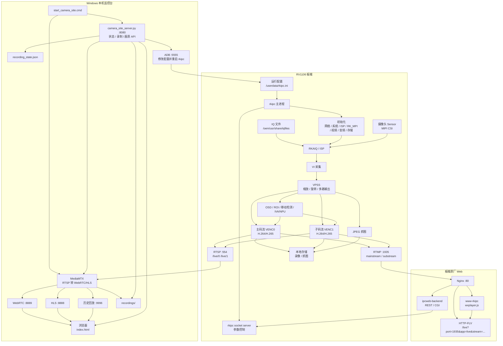
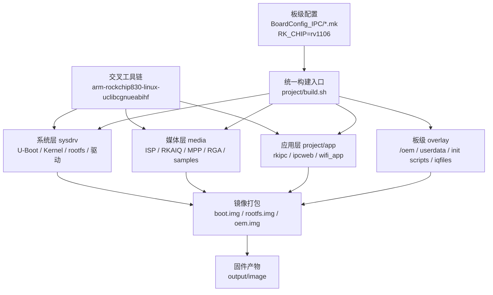

# Claude Project Context

## Project Type

This is a Luckfox Pico / Rockchip RV1106 Linux IPC camera SDK tree plus a local Windows camera dashboard. Treat it as an embedded camera firmware project, not as a normal single-language application.

The current root is `E:\code\rvtest`. It has no `.git` directory in this checkout.

## What The System Is

The SDK builds a complete RV1106 camera device stack:

- boot firmware and Linux system image
- media libraries and camera pipeline
- `rkipc` camera application
- optional factory IPC web UI/backend
- local Windows web dashboard for preview, recording, and board-side quality control

## Chip / Board

Primary chip: Rockchip `rv1106`.

Evidence in the tree:

- `project/cfg/BoardConfig_IPC/BoardConfig-EMMC-Buildroot-RV1106_Luckfox_Pico_Ultra-IPC.mk`
- `RK_CHIP=rv1106`
- `RK_APP_TYPE=RKIPC_RV1106`
- `RK_ARCH=arm`
- `RK_TOOLCHAIN_CROSS=arm-rockchip830-linux-uclibcgnueabihf`
- board DTS example: `rv1106g-luckfox-pico-ultra.dts`

The tree also contains RV1103/RV1126/RK3588 variants, but do not confuse those with the active RV1106 IPC path.

## Important Directories

| Path | Meaning |
| --- | --- |
| `project/build.sh` | Top-level SDK build orchestrator. |
| `project/cfg/BoardConfig_IPC/` | Board configs for Luckfox Pico RV1103/RV1106 IPC products. |
| `sysdrv/` | U-Boot, kernel, rootfs, drivers, filesystem image tools. |
| `media/` | Rockchip camera/media stack: ISP, RKAIQ, MPP, RGA, IVE/IVA, audio, samples. |
| `project/app/rkipc/` | Main board-side IPC camera app. Most runtime camera behavior lives here. |
| `project/app/ipcweb/` | Factory IPC web backend/frontend, REST API, Nginx, HTTP-FLV delivery. |
| `tools/` | Linux/Windows flashing, upgrade, packing, and toolchain assets. |
| `web/rv1106_camera_dashboard/` | Local Windows dashboard using Python + MediaMTX. |

## 主要运行链路



## What The Local Dashboard Does

`web/rv1106_camera_dashboard` is a Windows-side helper app:

- `mediamtx.exe` pulls board RTSP:
  - `rtsp://192.168.31.18/live/0`
  - `rtsp://192.168.31.18/live/1`
- MediaMTX exposes browser-friendly streams:
  - WebRTC: `http://localhost:8889/main`, `http://localhost:8889/sub`
  - HLS: `http://localhost:8888/main`, `http://localhost:8888/sub`
- `camera_site_server.py` serves `index.html` and JSON APIs on port `8080`.
- Recording state is stored in `recording_state.json`.
- Recordings go under `recordings/`.
- Quality presets are applied by ADB: edit `/userdata/rkipc.ini`, push it back, and restart `/oem/usr/bin/rkipc`.

Start it with:

```powershell
E:\code\rvtest\web\rv1106_camera_dashboard\start_camera_site.cmd
```

Then open:

```text
http://localhost:8080/index.html
```

Stop it with:

```powershell
E:\code\rvtest\web\rv1106_camera_dashboard\stop_camera_site.cmd
```

## Build Notes

Use Linux/Ubuntu or WSL2/Linux for SDK builds. Do not assume the full SDK can be built directly from Windows PowerShell.

Common SDK commands:

```bash
cd project
./build.sh lunch
./build.sh info
./build.sh media
./build.sh app
./build.sh sysdrv
./build.sh firmware
./build.sh allsave
```

构建链路如下：



## Where To Modify

- Camera capture, encoding, RTSP/RTMP, OSD, ROI, IVA/NPU:
  `project/app/rkipc/rkipc/src/rv1106_ipc/`
- Shared RKIPC modules:
  `project/app/rkipc/rkipc/common/`
- Factory web API:
  `project/app/ipcweb/ipcweb-backend/src/`
- Factory web static assets:
  `project/app/ipcweb/ipcweb-backend/www-rkipc/`
- Local Windows dashboard:
  `web/rv1106_camera_dashboard/index.html`
  `web/rv1106_camera_dashboard/camera_site_server.py`
  `web/rv1106_camera_dashboard/mediamtx.yml`

## Cautions For Future Agents

- Preserve vendor binaries, toolchains, prebuilt libraries, and firmware assets unless the task explicitly requires changing them.
- Be careful with Chinese text encoding. Some existing docs display mojibake in PowerShell output.
- Browser playback generally requires H.264; stock RV1106 ini examples may use H.265.
- If changing board runtime config, remember that `/userdata/rkipc.ini` is the writable runtime config used by `rkipc`.
- The current Windows dashboard hardcodes:
  - device IP: `192.168.31.18`
  - ADB serial: `192.168.31.18:5555`
  - ADB path: `E:\dev\ADB\platform-tools\adb.exe`
  - site port: `8080`
  - WebRTC port: `8889`
  - HLS port: `8888`
  - MediaMTX API: `127.0.0.1:9997`
- Current checkout has no Git metadata, so verify edits by reading files directly.
